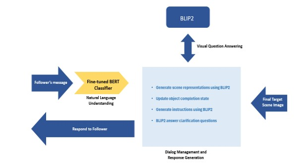

# Conversational Leader Agent for Collaborative Tasks using BLIP2 and GPT

## Overview
This repository contains the implementation and research findings from the Master's thesis titled **"Conversational Leader Agent for Collaborative Tasks using BLIP2 and GPT"** submitted to Heriot-Watt University.

The project explores the possibility of creating a leader conversational agent that collaborates with humans in real-world tasks using vision-language models (BLIP2) and large language models (GPT). The agent provides instructions and answers queries to help users complete a **Rearrangement Task**.

## Table of Contents
- [Abstract](#abstract)
- [Methodology](#methodology)
- [Implementation](#implementation)
- [Evaluation and Results](#evaluation-and-results)
- [Installation](#installation)
- [Usage](#usage)
- [Future Work](#future-work)
- [References](#references)

## Abstract
The research aims to develop a **Conversational Leader Agent** that collaborates with humans in task completion. Unlike traditional AI assistants, this agent provides **step-by-step guidance** in real-world scenarios through **visual and conversational grounding**. Using BLIP2 for vision-language processing and GPT for conversation management, the system generates task-specific instructions and handles clarifications dynamically.

**Keywords**: Visual grounding, conversational AI, collaborative AI, GPT, BLIP2, rearrangement task, leader agent.

## Methodology
The system follows a **two-stage process**:
1. **Understanding the Target Scene**: The agent extracts object details (type, color, shape, and position) from an image using BLIP2.
2. **Generating Task Instructions**: GPT generates step-by-step guidance for the user to rearrange objects to match the target scene.

### Architecture


## Implementation
The implementation consists of two major components:

### 1. **Baseline Model**
- Uses a traditional chatbot architecture with predefined templates.
- Employs BLIP2 for **visual question answering (VQA)**.
- Implements a rule-based **dialogue manager**.

### 2. **GPT-powered Conversational Leader Agent**
- Uses **BLIP2 and GPT-3.5 Turbo** for a more natural conversation.
- Dynamically generates and refines instructions based on user responses.
- Handles **clarification questions** effectively.

### Sample Interaction
```
User: What should I do next?
Agent: Move the red apple to the center of the table.
User: Which apple? There are two red apples.
Agent: The red apple on the left side of the table.
```

### AI2Thor Integration (Initial Attempt)
- The AI2Thor 3D environment was initially explored but was **not used** due to challenges in object recognition by BLIP2.
- Instead, **real-life tabletop rearrangement** was chosen for evaluation.

## Evaluation and Results
The system was evaluated based on:
- **Task success rate**: How accurately users followed instructions.
- **User satisfaction**: Rated on clarity, naturalness, and helpfulness of instructions.
- **Comparison with baseline**: The GPT-powered agent performed **better in natural conversation** and **clarification handling**.

### Sample Result Visualization


## Installation
Clone the repository and install dependencies:
```sh
$ git clone https://github.com/Vk-Singh/Collaborative-Agent-Rearrangement-Taskhttps://github.com/your-repo/conversational-leader-agent.git
$ cd conversational-leader-agent
$ pip install -r requirements.txt
```

## Usage
Run the agent with:
```sh
$ python main.py
```

## Future Work
- **Enhancing object tracking**: Improve tracking of the user's state during the rearrangement task.
- **Integration with GPT-4V**: Utilize newer vision-language models for enhanced reasoning.
- **Support for multimodal input**: Incorporate **speech-based** interactions.

## References
- Li et al., "BLIP2: Bootstrapping Language-Image Pre-training", 2023.
- OpenAI, "GPT-3.5 Turbo", 2023.
- Padmakumar et al., "Two-Agent Task Completion Benchmark (TEACh)", 2021.
